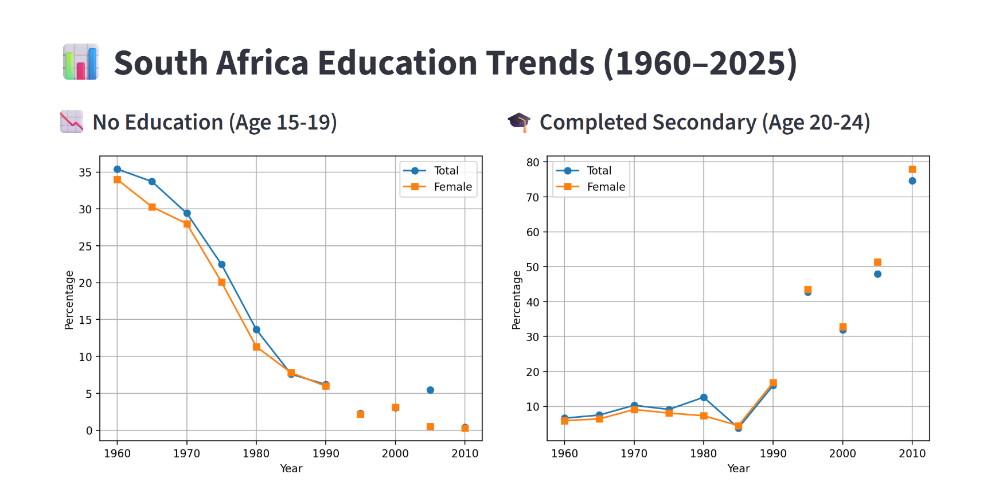
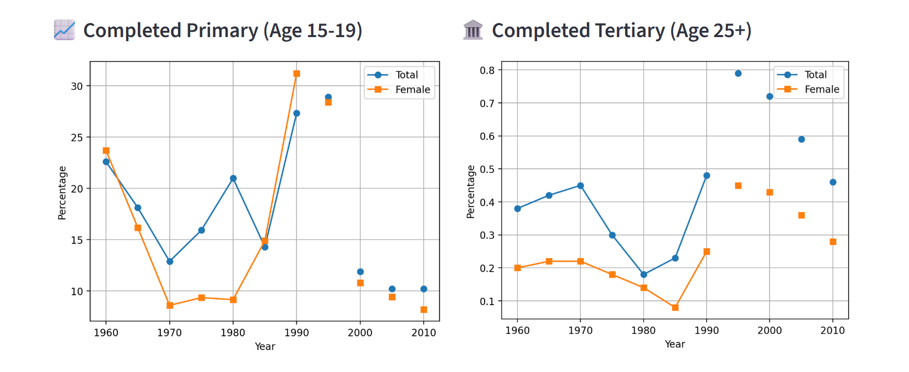
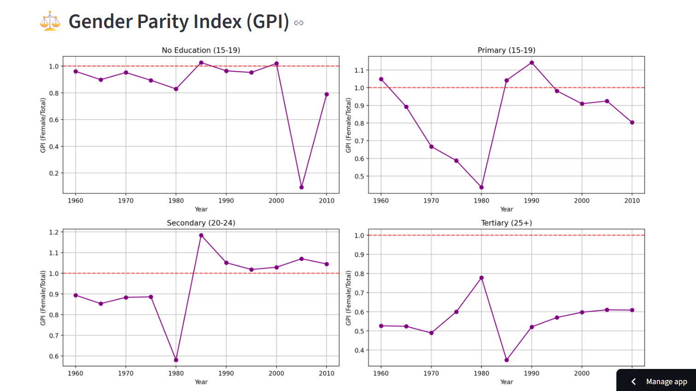

# South Africa Education Trends Dashboard (1960–2025)

An interactive data dashboard exploring six decades of educational attainment, gender equality, and learning outcomes in South Africa. Built with Python and Streamlit, this project combines multiple international datasets to visualise long‑term trends and uncover key insights.

# Live Demo
👉 **[View the live dashboard here](https://sa-education-dashboard-c4bjpukfkwqy2a3htrwtfc.streamlit.app/)**  
(click the link – it may take a few seconds to wake up)

# About the Project
I wanted to understand how education in South Africa has evolved since 1960, especially the impact of major political and social changes. The dataset brings together information from five sources:
- Barro‑Lee – educational attainment by age and gender (every 5 years)
- UNESCO (UIS) – enrolment rates, out‑of‑school children, repetition rates
- World Bank – government spending on education
- PIRLS & TIMSS – international learning assessments (reading, maths, science)

I cleaned and merged all these indicators, computed a Gender Parity Index (GPI) to track gender gaps, and built an interactive dashboard so anyone can explore the trends.

# Features
- Filter by year range – slide to focus on specific decades
- Four attainment charts – no education, primary, secondary, tertiary (with female vs total comparison)
- Gender Parity Index (GPI) – see when females caught up to or overtook males
- PIRLS learning outcomes – proficiency benchmarks (low, intermediate, high)
- Raw data view – check the numbers behind the charts

# Built With
- Python – pandas, matplotlib, seaborn
- SQLite – for storing the cleaned data
- Streamlit – interactive web app framework

# Screenshots
Dashboard Preview

  # Key Insights
- No education (age 15‑19) dropped from 35% in 1960 to near 0% in 2010 – a huge success.
- Secondary completion (age 20‑24) soared from under 10% to over 70% in the same period.
- Females overtook males in secondary completion after 1985 (GPI > 1.0).
- Tertiary attainment remains very low for both genders (<1%) – a persistent challenge.
- PIRLS reading proficiency shows that most students still score below the low benchmark, indicating quality gaps.

# How to Run Locally
1. Clone this repository  
   `git clone https://github.com/jzoe68159-png/sa-education-dashboard.git`
2. Install dependencies  
   `pip install -r requirements.txt`
3. Run the app  
   `streamlit run dashboard.py`

#  Repository Structure
- `dashboard.py` – main Streamlit app
- `education_final.csv` – cleaned dataset
- `requirements.txt` – Python packages
- `README.md` – you're reading it!

# Author
**Zoe John** 

If you have any questions or suggestions, feel free to reach out.

Made with 💖 and a lot of coffee
